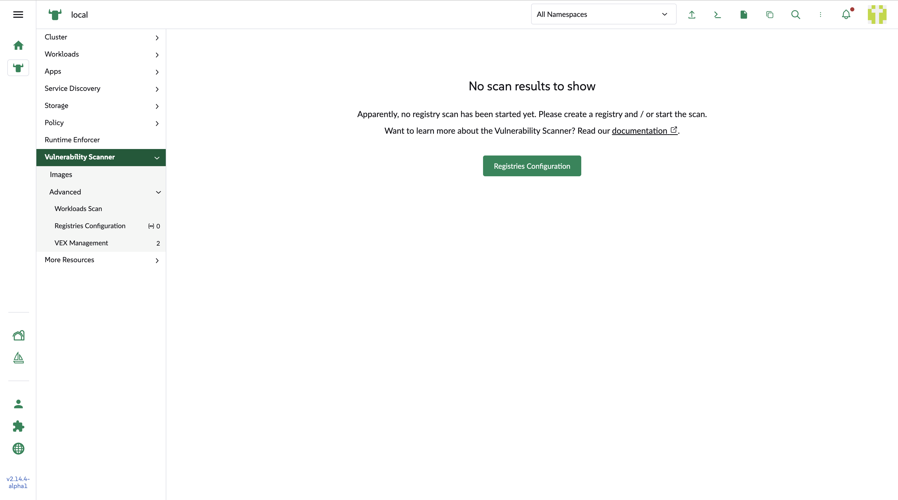
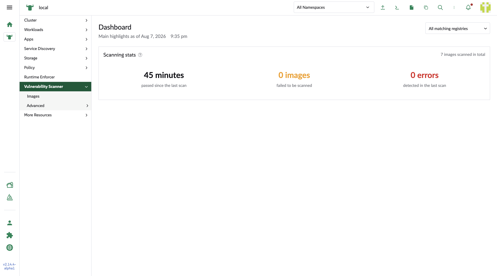

## Dashboard
Main menu of Vulnerability scanner leads the user to Dashboard page. The user can user the registry filter to review the scanning stats of specific registry.

### Initial veiw
Provide a button to redirect to registries configuration page for users to create a registry.

### Scanning stats
From the left to the right, the stats show:
1. How long from the time of the last scanning
2. How many images are failed from the scanning. 
3. In the scan history, how many times the error happened.

The data is based on registries' scan result. The workloads' do not display in this panel.

