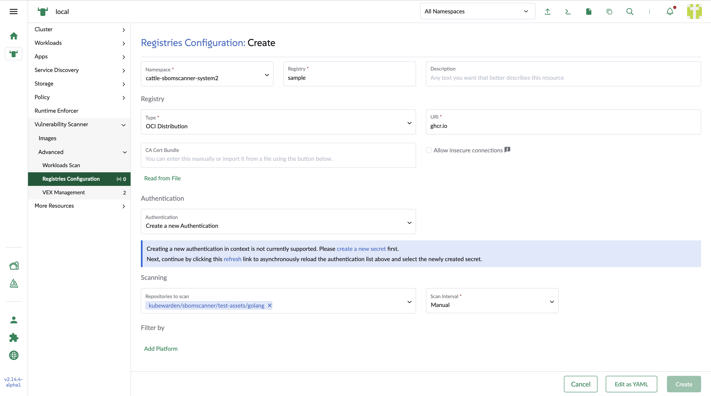
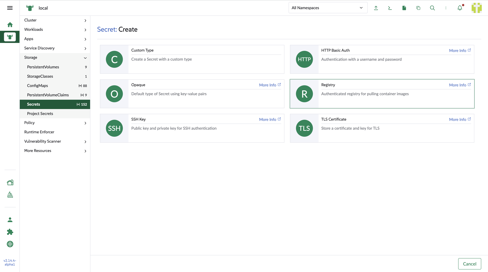
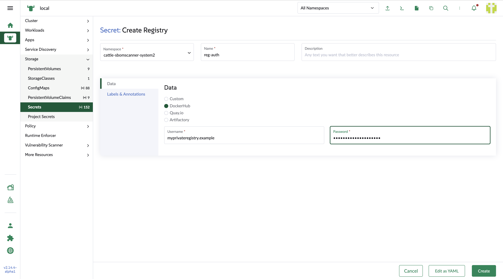
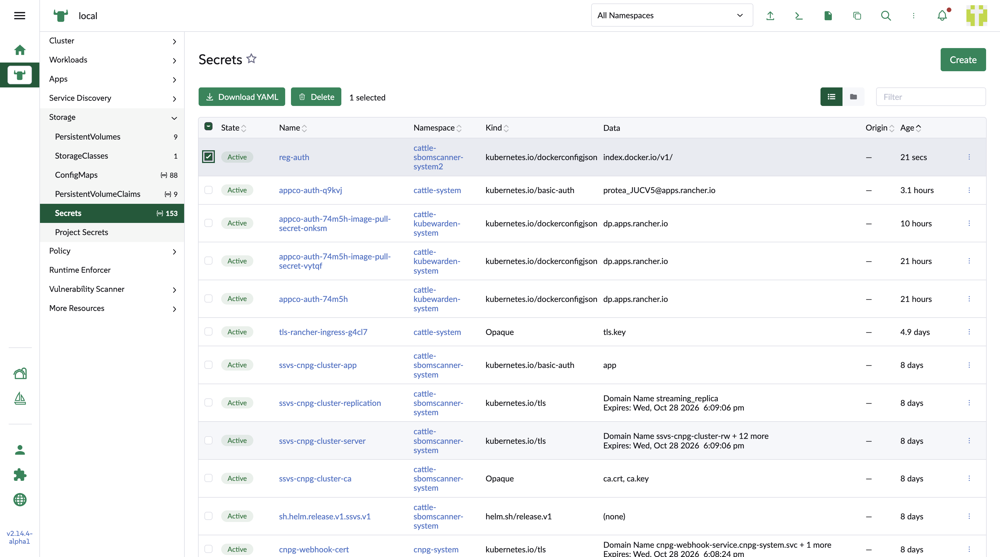
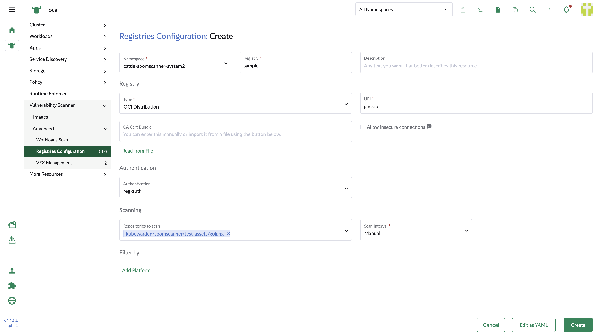

## Create / Edit registry

### Configuration interface

1. Namespace

    The registry is a namespaced asset.

2. Registry

    Define a unique registry name.

3. Description

    Write some brief of the registyto describe the resource.

4. Type

    Support OCI distribution by default.

5. URI

    The URL os the registry.

6. CA Cert Bundle

    For AirGaped registry, it use certificate to connect secured resource in the internal network.

7. Allow insecure connections

    In same case,for testing in some trusted interal resource, it provide an option to skip the SSL/TLS verification.

8. Authentication

    Use credential to create secret for the registry's authentication. The user need to create the secret through external link for the `Create secret`. (Refer to: Create registry secret)

9. Repositories to scan

    Add repositories tag in the tag input box

10. Scan Interval

    Define the periodic scan. Otherwise, set into `Manual`

11. Filter by Platform

    To limit the scope of the scan, the user can set multiple platfrom filters to focus on specific scope. For each platform, set OS, Architechture and Variant to identify it.

### Create registry secret

In the creat registry configuration page, click the link in the banner to create a new secret or choose an existing secret from the dropdown.If creating a new one, the link will open secret page in a new tab in the browser with the same session on the Rancher manager. The users can use that page to create secret.

Select Registry badge to create a registry secret

Choose DockerHub and type in the username and password

After saving the secret, the users can see the created one in the secret list.

When going back to the original tab, the users can open the authentication dropdown to choose the newly created one.

