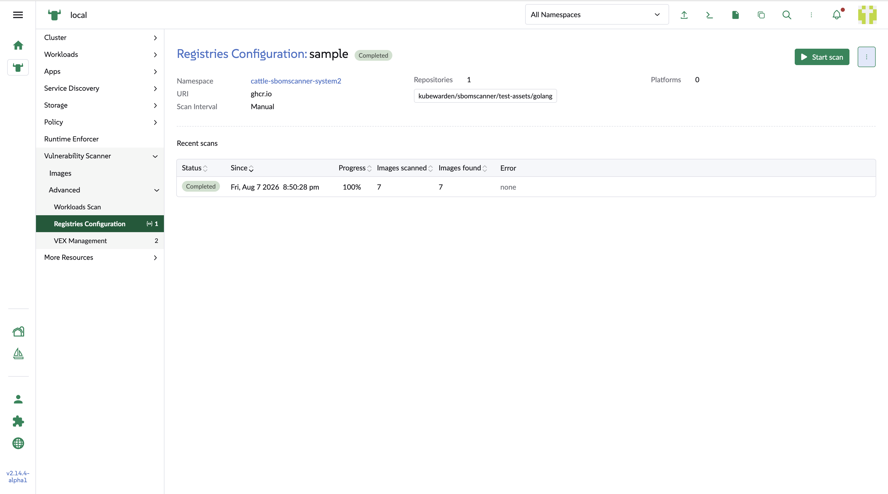

## Registry detail

### Metadata

1. Namespace
    
    It can link to the namespace list page in the Rancher manager

2. Repositories

    If there is any matched conditions expression from the backend configuration, the tag will show a filter icon to allow the users click to see the YAML code of the matched conditions. The users can also use the copy it into cliboard.

### Scan history table

The list in the table shows the history of the scanning which is ordered by the last updated timestamp in ascend sequence.

