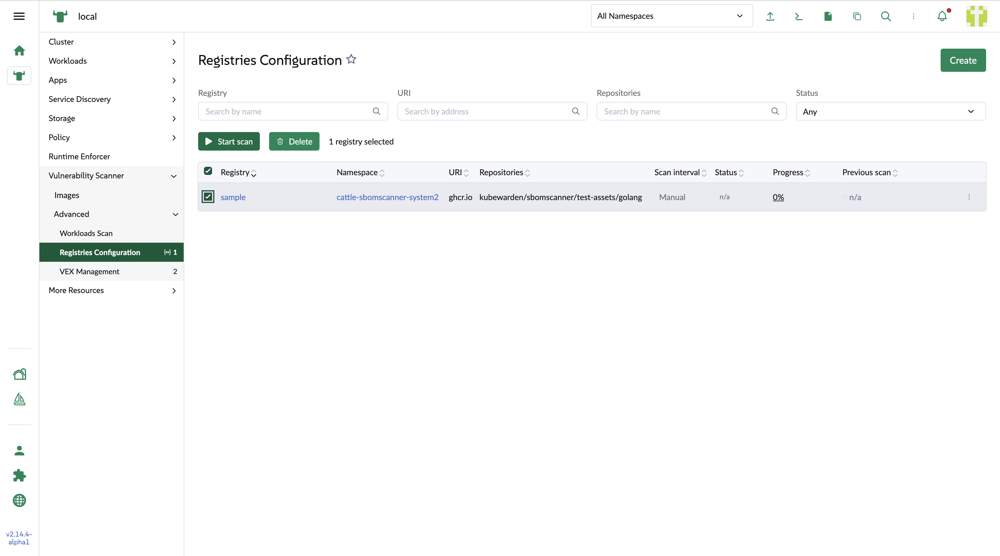
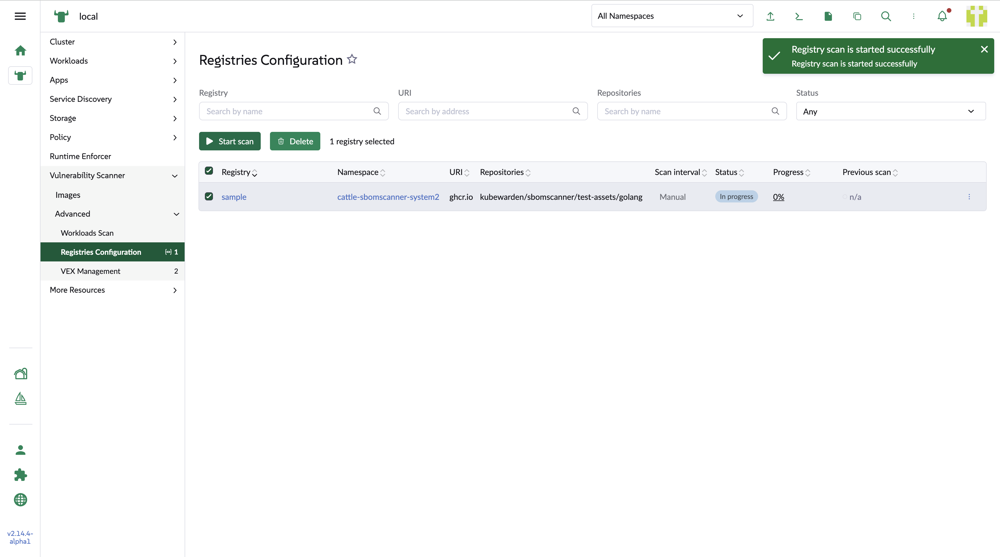
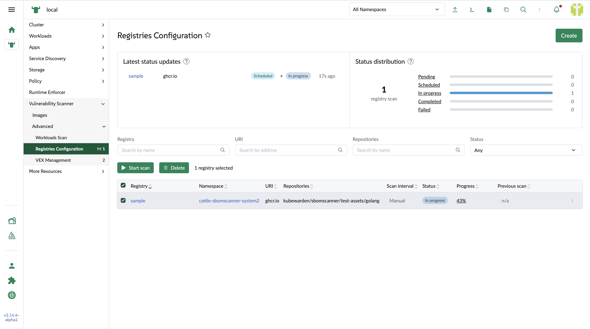
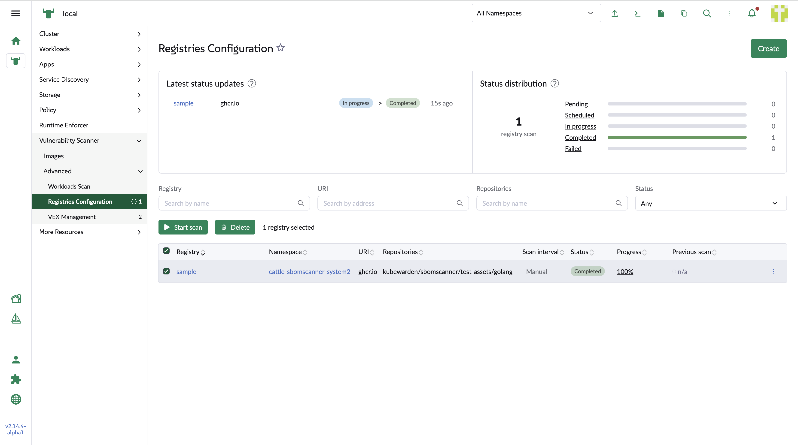

## Registries configuration list

This page is showing the registry list with columne based filters.

### List table

1. Registry

    It can link to the registry detail page

2. namespace

    It can link to the namespace list page in the Rancher manager

3. Status
    * Pending
        Registry is created, no scan has been started
    * Scheduled
        Just start a scan. The backend does not return the `In process` status
    * In process
        The backend returns the `In process` status with the corresponding detected images
    * Complete
        All the images have been scanned, and the backend returns `Complete` status
    * Failed
        The scan of all or a part of the detected images got failures. The backend returns `Error` status

4. Progress

    The percentage of the completed scan by deviding the scanned imaged by detected images. The percentage link can show the scan detail of the amounts which are used to calculate it. In the case of failed scan, it also shows the `Error` link to show the erroe message in the popup while hovering on it.

5. Previous scan

    The last scan status with progress and error.

### Scan selected registries

The user can either run a bulk scan by selecting the registries in the table and click the `Start scan` button on the top of the table, or use the row action menu to choose `Start scan` to run a single registry scan.

### Showing scan progress with status charts

During the scanning, the scan progress and status charts will display on above the table. The user can review the recent 5 scan history on the left chart, and also review and filter the status in the right chart. By clicking the status label in the chart, the status column based filter will be effected correspondingly.
The charts will be refreshed every 20 second.

### Complete status

After the scan is finished, the backend could return complete or failed. The status will show the status badge according to the result. For the failed on, there will be an `Error` link to show the error message in the popup when hovering it

