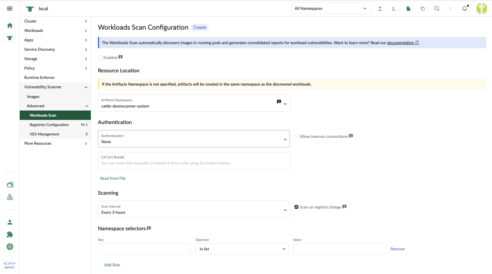
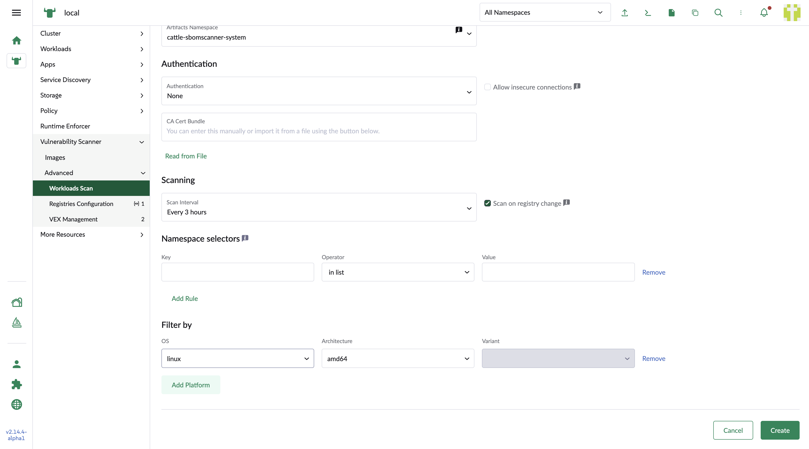
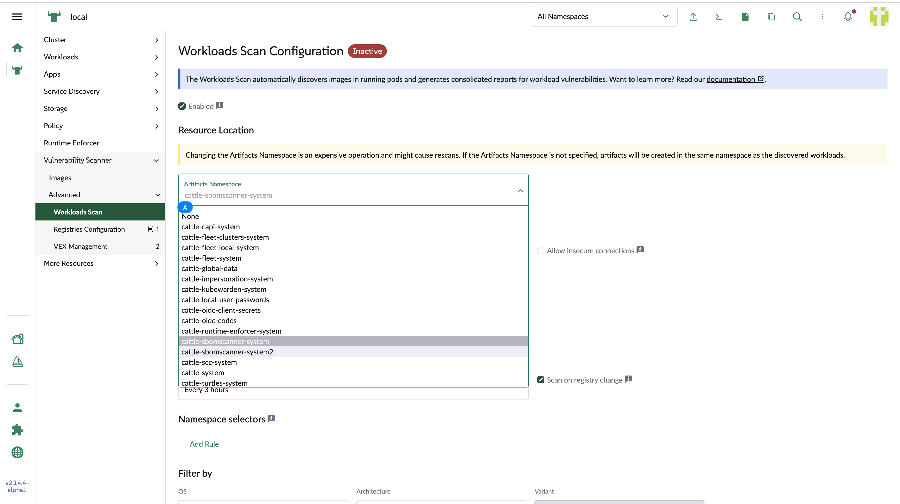
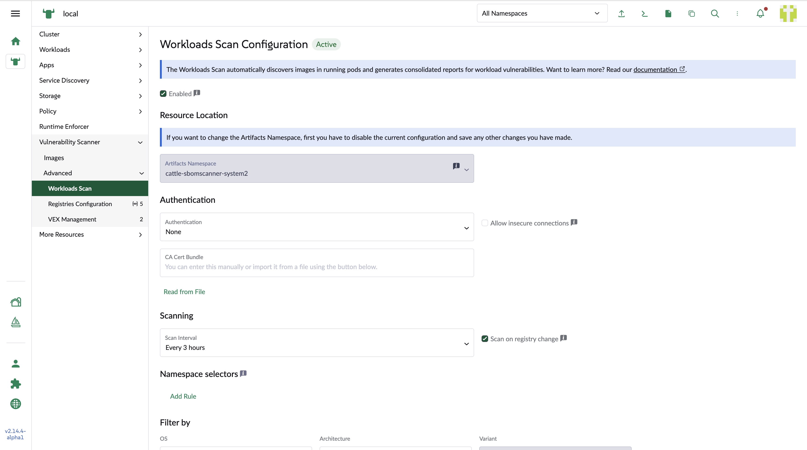

## Wrokload configuration

### Create a workload scan configuration

1. Artifacts namespace

    The Namespace where managed Registry, ScanJob, Image, SBOM, and VulnerabilityReport resources are created. If omitted or empty, managed artifacts are created in the workload's namespace.

2. Scan on registry change

    Automatically scan for vulnerabilities whenever a new container image is detected in your running workloads.

3. Namespace selectors

    A standard Kubernetes label selector. Only workloads in namespaces matching the selector are scanned. If omitted, workloads in all namespaces are scanned.

Other configuration fields are the same as the registry configurations.

### Change the artifacts namespace when the configuration is disabled

If the users need to change the artifacts namespace, the configuration should be disabled.

### Enable the configuration to schedule the workload scan

While the configuration is enabled, the scan is scheduled.

