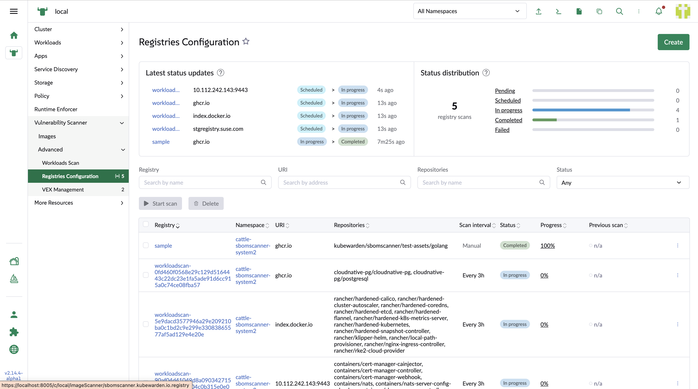
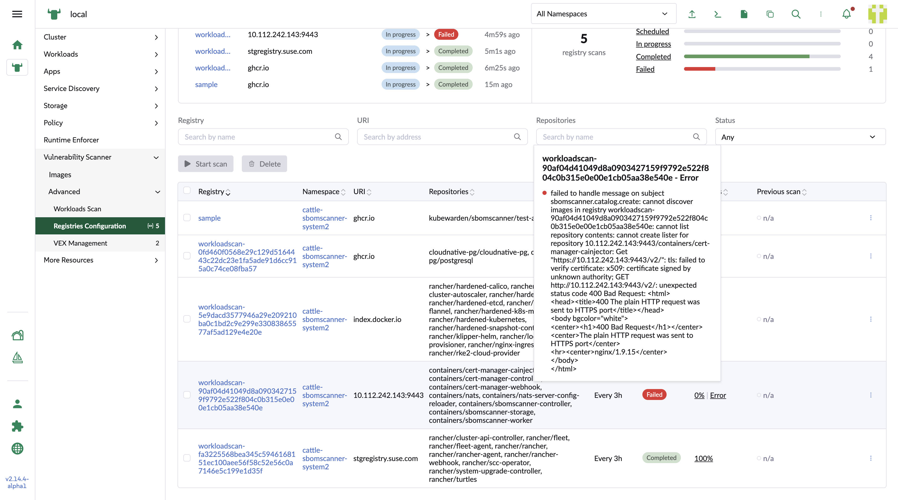

## Workload scan related registry list

In the registry list page, it also list the images which are running in the workloads which have been scanned. They display as virtual registries to list which repositories the images belong to.

