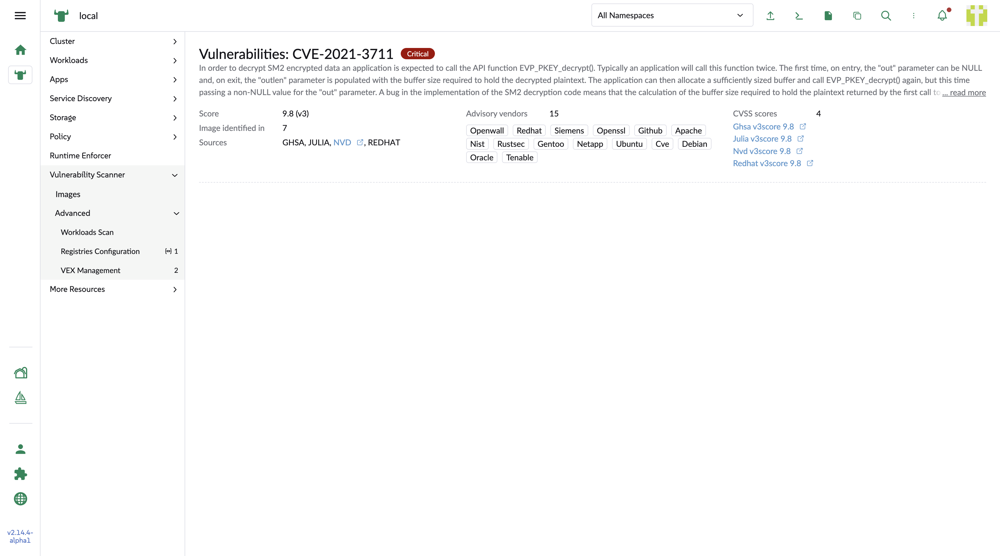

## CVE detail

1. Description

    The statement of the CVE which decribe the detail of the CVE

2. Score

    The highest score which is calculated from multiple sources

3. Adviory vendors

    The vendor names who provide advisor of the CVE

4. CVSS scores

    Show the number and list all the scores from multiple sources

5. Image identified in

    The number in how many images the CVE is detected

6. Sources

    The orgnizations who calculate the CVE score according to different arguments. It provide the external link to let the users open the corresponding website in a new tab of the browser.

