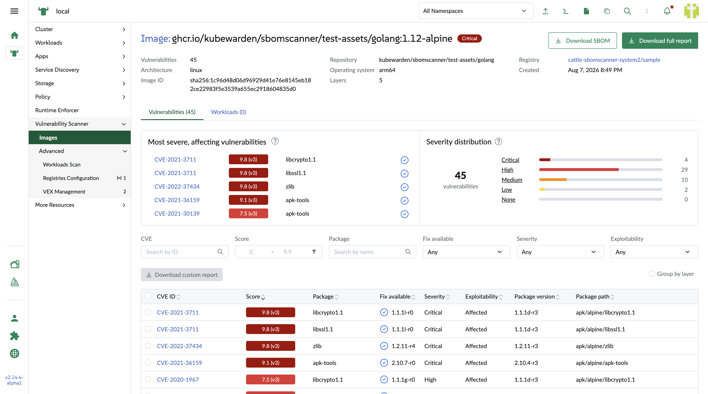
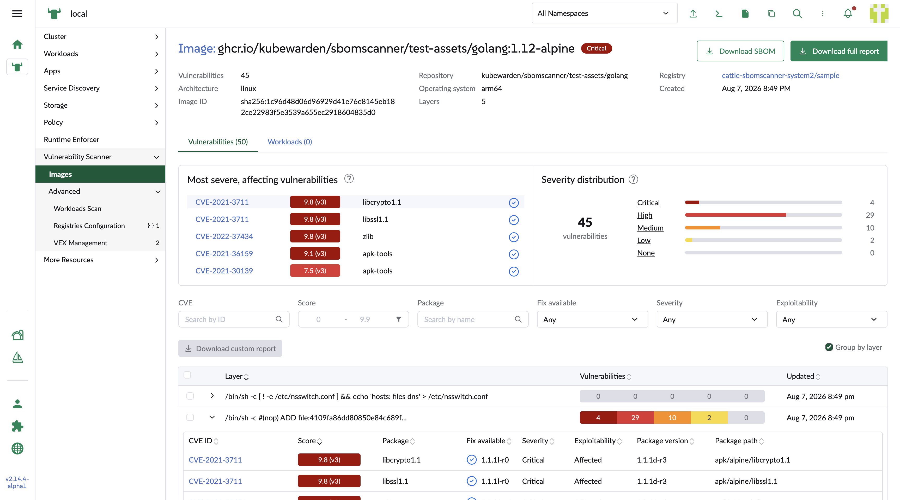
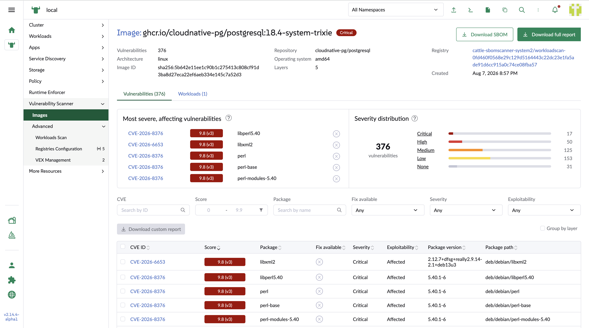
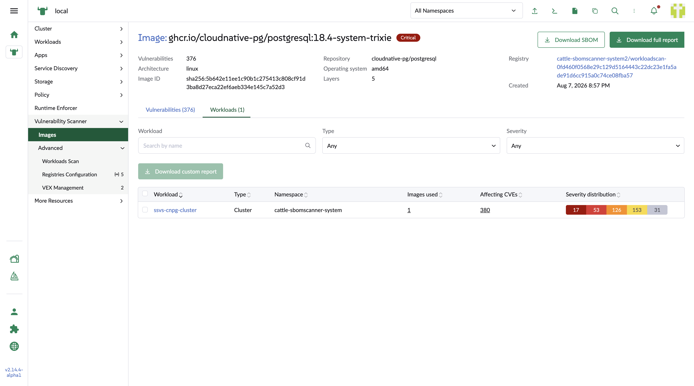

## Image detail

### Registry image

Metadata

1. Vulnerabilities

    The number of the vulnerbalities in this image

2. Repository

    The repository which the image belongs to.

3. Registry

    The registry which the image belongs to.

4. Architecture

    The architecture of the infrustructure in this image, like amd64, arm64.

5. Operating system

    The operating system of the infrustructure in this image, like Linux, Windows

6. Created

    The timestamp when the image created.

7. Image ID

    The SHA code of this image which can identify this image.

8. Layers

    The number of layers in this image

Charts

1. Top 5 severe affacting vulnerabilities

    The brief of the most severe affecting vulnerability list.

2. Severity distribution

    It shows the distribution of the vulnerabiity numbers based on severity. By clicking the severity value, it also trigger the severity filter change in the column based filter of the vulnerability table.

Vulnerability list table

1. CVE ID

    It can link to the CVE detail page.

2. Score

    The most severe score among the resources with the corresponding severity background color in the badge. It shows the CVSS version as well.

3. Package

    The vulnerable package about the CVE.

4. Fix available

    It shows if there is a fix version for this CVE. If yes, it also shows the version number.

5. Severity

    It shows the severity text which the backend calculated.

6. Exploitability

    It shows if the CVE is suppressed by VEX, such as `Affecting`, `Suppressed`.

7. Package version

    The version of the affected package.

8. Package path

    The absolute path of the package in the image.

Layer based vulnerability list

1. Layer

    The command brief of the layer

2. Vulnerabilities

    The bars of severity based number of vulnerabilities

3. Updated

    The last updated timestamp of the layer.

Subtable is the same as vulnerability list table

### Workload image

Workload reference table

1. Workload

    The workload which is using the image.
    It can link to the corresponding workload detail page.

2. Type

    The workload type, such as Cron job, Deployment, Daemon set, Stateful set, Job, Replica set.

3. Namespace

    The namespace which the workload belongs to.
    It can link to the correspondin namespace detail page.

4. Image used

    It shows how many images are used in this workload.
    It can link to the vulnerabilities tab of the workload detail page and open the images subtab

5. Affecting CVEs

    The number of effecting CVEs in this workload.
    It can link to the vulnerabilities tab of the workload detail page and open the Effecting CVEs subtab

6. Severity distribution

    Severity based distributed numbers of vulnerabilities in the workload

    
