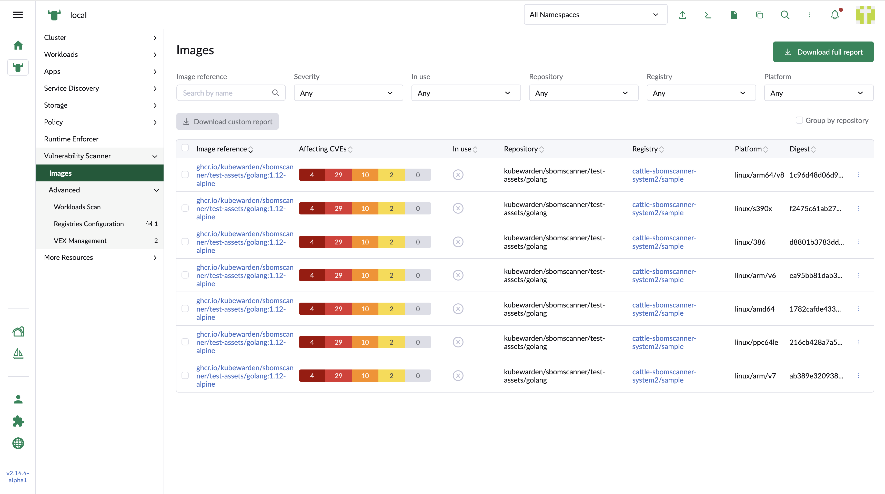
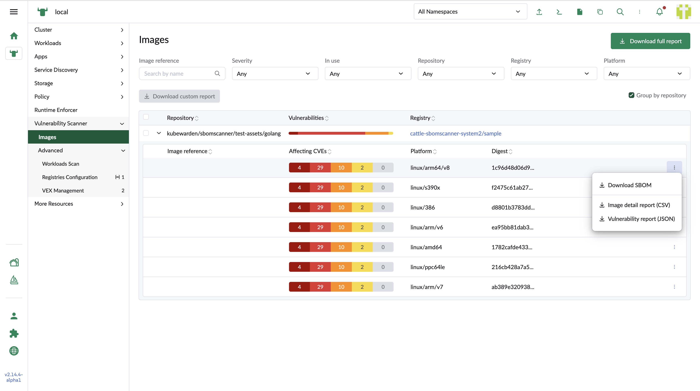
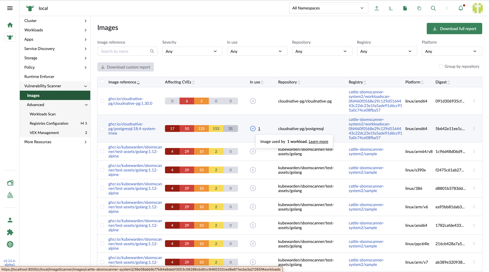

## Image list

### Registry's image list

The scanned image list table with column base filters.

1. Image reference

    It shows the image name. It will redirect to image detail page

2. Affecting CVEs

    It shows the bars with the severity based number distribution of the CVEs.

3. In use

    It shows the status and the number of the related workloads.

4. Repository

    The repository which the images belong to.

5. Registry

    The registry which the images belong to.

6. Platform

    The platform which the image is deployed in.

7. Digest

    The SHA code which identifies the image.

Click `Group by repositories` checkbox to switch the table view into a repository based list. The sub-table under the row displays the image list which is under this reposiroty.

### Workload's image list

In the images, the workload related ones show the `In use` is checked. It is along with the number of the related workloads with the tooltip to instruct the details

### Export reports

Row base action to download the CSV and json format Vulnerability report and SBOM report.

Global download for the full vulnerability report.

Bulk download for selected images's vulnerability report.