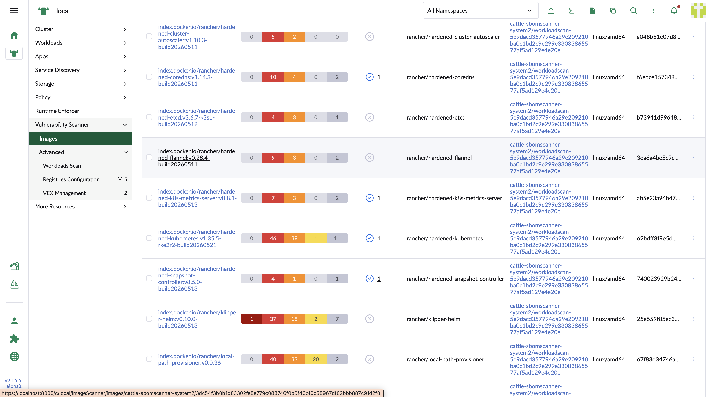
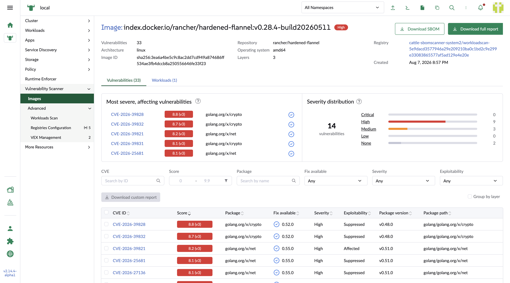
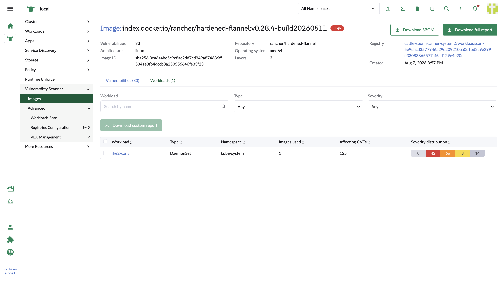
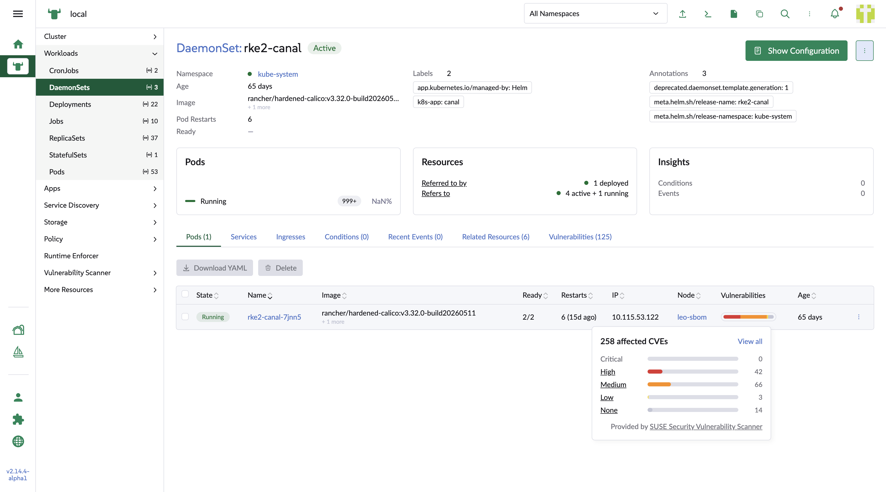
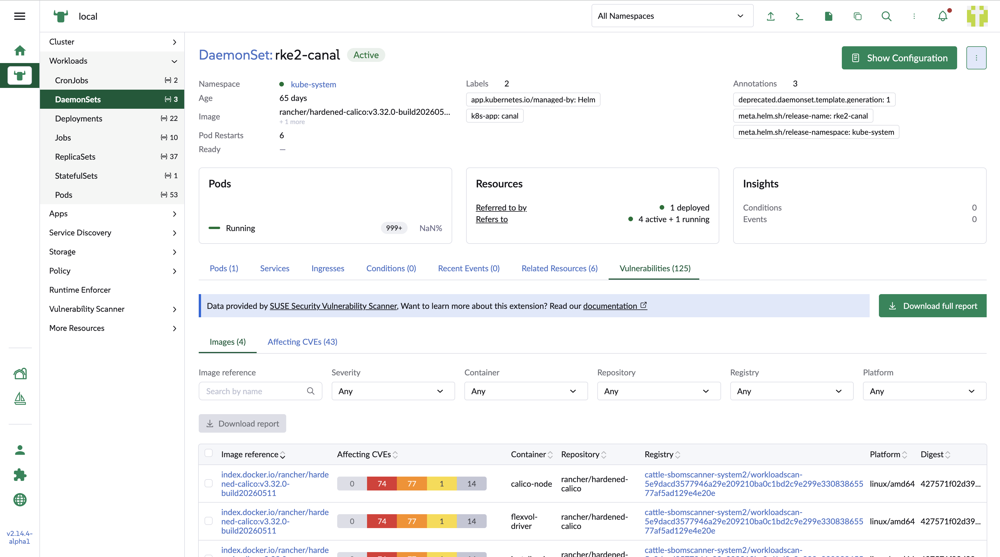
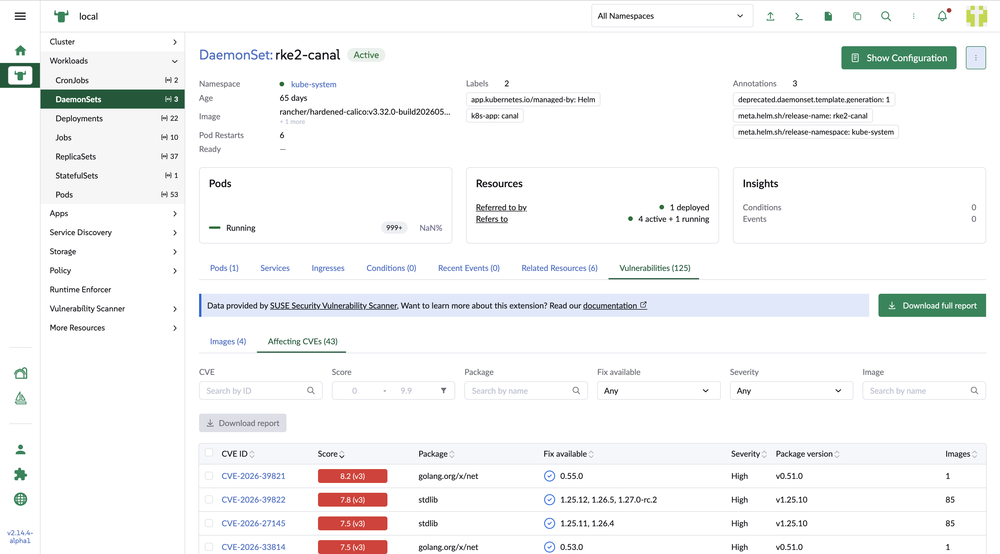

## Workload interaction

The UI extension provide cross-application interactions between image detail page and workload detail page

1. Select a workload image in the image list page

2. Go to image detail page

3. Selecte `Workloads` tab to review the workload list

4. By clicking the workload link, it redirects to workload detail page in the Rancher manager. In the pod list, Vulnerabiity scanner UI extension provide an injected column to show the vulnerability number by a stacked bar based on severity.

    When hovering on the bar, a popup shows the bar chart based on severity.

    The users can click the severity link to redirect to the `Vulnerabilities` tab and open the `Affecting CVEs` subtab with the selected severity as a column based filter value.

    The users also have a way to click `View all` link to redirect to the `Vulnerabilities` tab as well.By default it will open the `Images` subtab under it.

5. In the `Images` subtab, the table is the same as the image list table with the column based filters. The users can click the `Image reference` to link to the coresponding image detail page in the UI extension.

6. In the `Affecting CVEs` subtab, the table is the same as the vulnerability list table with the column based filters The users can click the `CVE ID` to redirect to corrresponding CVE detail page in the UI extension.

The users can export the Vulnerabilities report in this page for either full report or the customized report based on selection.